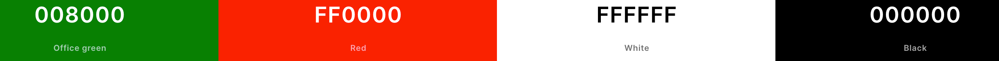
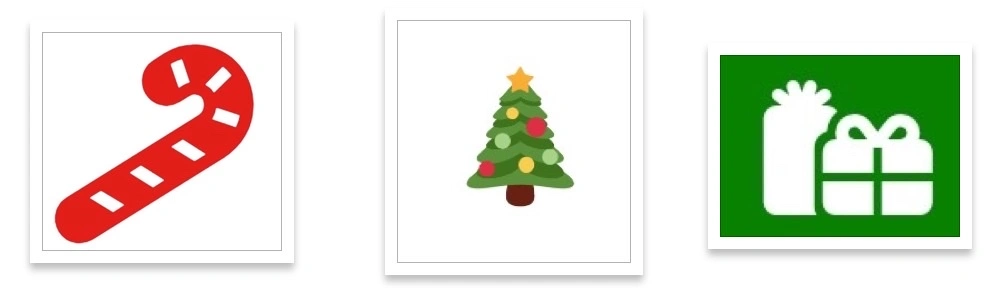
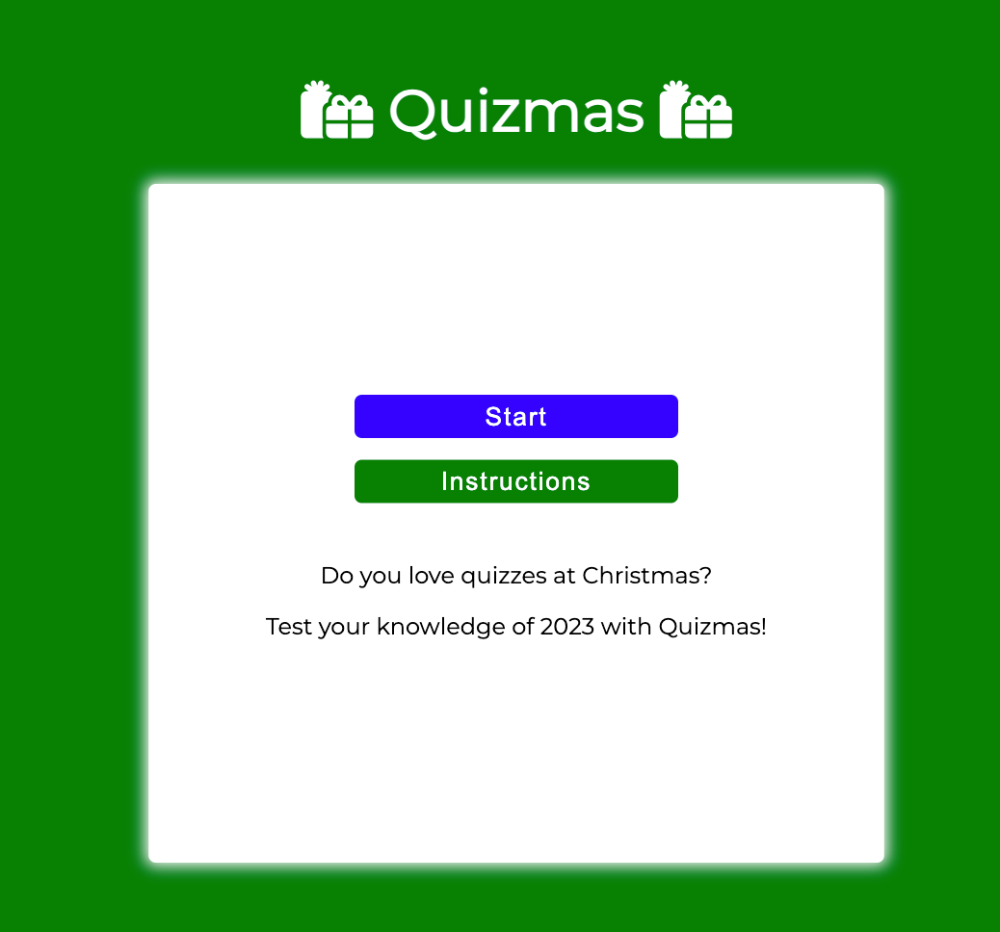
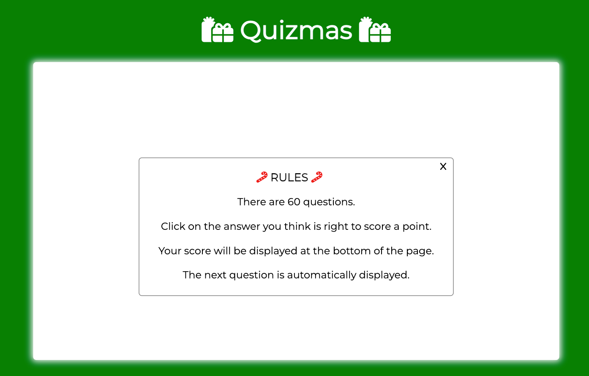
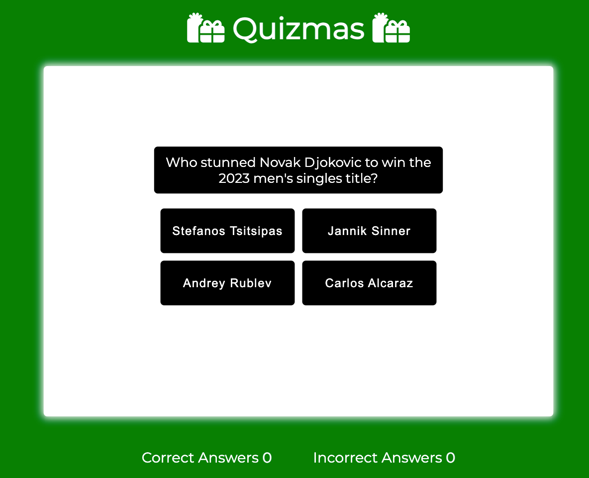
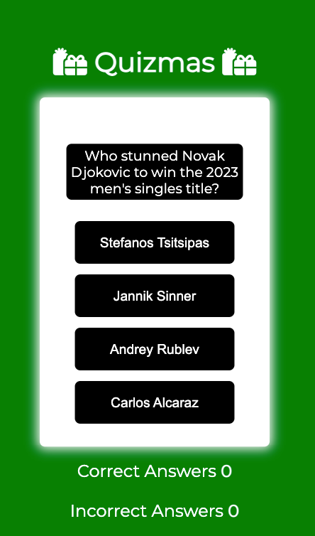

# Quizmas

Quizmas is a multiply choice 2023 general knowledge quiz for adults to play over Christmas. There are 60 questions and the aim of the game is to get as many questions correct as possible. The game is designed to be fun and engaging with the use of bright colourful imagery.

This game is a great way to improve your knowledge of 2023 current affairs.

The live link can be found here - [Quizmas](https://cgrace0044.github.io/quizmas/index.html)

ADD RESPONSIVE IMAGE

## Site Owner Goals

- To provide the user with an easy to navigate game that is both fun and educational.
- To present the user with a website that is visually appealing and fully responsive.
- To entice the user to return to the game to improve their score.
- To encourage the user to share the game with friends and family to see who can get the highest score.

## User Stories

- ### First Time User

  - As a first time user I want to understand the main purpose of the game
  - As a first time user I want to be able to intuitively navigate the game, play the game, see my score and restart the game once it ends.
  - As a first time user I want to have fun and test my knowledge of 2023.

- ### Returning User

  - As a returning user I want to be able to play the same game but with the questions in a different order.
  - As a returning user I want to be able to improve on my previous score.

## Design and Colour Scheme

The imagery and colour scheme of the site were both given careful consideration to ensure they compliment each other. The imagery used in the game is very important to the overall experience of the user.

- Given that the game will be predominently played over Christmas 2023, Christmas colours were chosen.

Colour palette from Coolors

There are a few subtle Christmas images included on the site including the favicon and some Font Awesome icons used in headers:

Great care was taken to establish a good contrast between background colours and text at all times to ensure maximum user accessibility.

### Fonts

The Montserrat font is the main font used throughout the whole website. This font was imported via [Google Fonts](https://fonts.google.com/). 

Sans Serif is used as a backup font, in case for any reason the main font isn't being imported into the site correctly.

### Layout

The site is a single page with 4 main sections:

- Start screen
- Instructions screen
- Quiz screen with questions and answers
- Gameover and option to restart screen

## Features

### Home Page

The landing page of the website has a very simple layout which includes a H1 heading stating the name of the game and two buttons:

- Start
- Instructions

The H1 heading contains an link to the landing page.

### Instructions

If the user clicks the "Instructions" button the user can read the main rules of the game. The 'X' button will take them back to the landing page.

### Game Area

- Once the user clicks start on the landing page the first question together with four answers are displayed.
- If the user clicks the correct answer it turns green, otherwise it runs red.
- Once an answer has been clicked the next question will be automatically displayed after a short pause of two seconds.
- As the game progresses a running correct/incorrect answer score is displayed below the game-area.
- A 'Math Random' function was used so that the questions are shuffled.
- The order of the answers to a corresponding question are also shuffled.

### Game Over

- Once the player has answered 60 questions the Gameover screen will be displayed.
- This screen simply states 'gameover' and there is an opportunity to restart the game.
- The final tally of correct and incorrect answers is also shown on this screen.

INPUT THE GAMEOVER SCREEN

### Features Left to Implement

- Ability for the user to input a username
- A leaderboard
  
## Testing

### Validator Testing

HTML

- No errors were returned when passing through the official W3C Markup Validator
INPUT SCREENSHOT HERE

CSS

- No errors were found when passing through the official W3C CSS Validator
INPUT SCREENSHOT HERE
  
Javascript

- No errors or warnings were returned.
INPUT SCREENSHOT HERE

### Accessibility

- The site achieved a Lighthouse accessibility score of 100% on both mobile and desktop which confirms that the colours and fonts chosen are easy to read and accessible

Mobile Lighthouse Score

INPUT FINAL LIGHTHOUSE SCREENSHOT HERE

Desktop Lighthouse Score
INPUT FINAL LIGHTHOUSE SCREENSHOT HERE DESKTOP

### Button Testing

- All buttons were tested manually to ensure the user is directed to the correct section of the website and functions run as intended.

### Game Testing

- The game was thoroughly tested by friends and family to ensure that everything worked as intended including the following:
  - Questions were shuffled so that they don't appear in the same order.
  - Answers to each corresponding questions were shuffled.
  - The game ends once 60 questions have been answered.
  - The user can only select one answer to each question.
  - The total correct and incorrect scores sum to 60 at the end of the game.
  - The next question is automatically displayed once the user has clicked an answer. There is a short timelag of two seconds.
  - Once the game is finished there is an opportunity to restart the game.

### Browser Testing

- The Website was tested on Google Chrome, Firefox, Microsoft Edge, Safari browsers with no issues noted.

### Device Testing

- The website was viewed on a variety of devices such as Desktop, Laptop, mobile and tablet to ensure responsiveness on various screen sizes in both portrait and landscape mode. The website performed as intended. The responsive design was also checked using Chrome developer tools across multiple devices with structural integrity holding for the various sizes.

### Fixed Bugs

#### Next Button

- Originally I had a next button which called the next question.
- This required the user to make a lot of clicks - the next button also moved depending on the length of the question.
- To improve the user experience I got rid of the next button and implemented a timer function whereby the next question was automatically displayed following a correct/incorrect answer to the previous question.

#### Start Button

- Originally the start button was red but this caused a poor accessibility score. Once I changed the colour the accessibility score was 100%.

#### Answer Buttons

- For some time there was an issue where the next question function appended its answers along with the answers of the previous question.
- This meant eight answers were showing - four of which were irrelevant to the current question.
- In order to fix this I had to empty the answers' previous HTML using answerButtons.innerHTML = ''.

### Known Bugs

There are no known bugs.

## Technologies Used

### Languages

- JavaScript
- HTML5
- CSS3

### Frameworks - Libraries - Programs Used

- [Am I Responsive](http://ami.responsivedesign.is/) - Used to verify responsiveness of website on different devices.
- [Chrome Dev Tools](https://developer.chrome.com/docs/devtools/) - Used for overall development and tweaking, including testing responsiveness and performance.
- [Font Awesome](https://fontawesome.com/) - Used for icons in information bar.
- [GitHub](https://github.com/) - Used for version control and hosting.
- [Google Fonts](https://fonts.google.com/) - Used to import and alter fonts on the page.
- [W3C](https://www.w3.org/) - Used for HTML & CSS Validation.
- [Coolors](https://coolors.co/) - Used to create colour palette.
- [Favicon](https://favicon.io/) - Used to create the favicon.

## Deployment

The project was deployed using GitHub pages. The method followed to deploy the site was as follows:

1. I went to the settings tab in my Github repository.
2. On the left-hand side-bar in the code and automation section I selected Pages.
3. I selected Source - Deploy from branch.
4. The main branch was selected and the folder was set to root.
5. Under branch I clicked save.
6. Back in the code tab in the Environments section I clicked on Github Pages.
7. Finally I clicked on view deployments to see the live site.

The live link can be found here - [Quizmas](https://cgrace0044.github.io/quizmas/index.html)

## Cloning

To clone this repository follow the below steps:

1. Locate the repository at this link [Quizmas Repository](https://github.com/cgrace0044/quizmas).
2. Under **'Code'**, see the different cloning options, HTTPS, SSH, and GitHub CLI. Click the prefered cloning option, and then copy the link provided.
3. Open **Terminal**.
4. In Terminal, change the current working directory to the desired location of the cloned directory.
5. Type **'git clone'**, and then paste the URL copied from GitHub earlier.
6. Type **'Enter'** to create the local clone.

## Credits

### Content

The inspiration for this game came from my family who love playing quizzes over the Christmas holidays. During Christmas 2023 we played this quiz and everyone really enjoyed it.
The quiz questions came from various 2023 quizzes that I found online including:

- [Quiz of the Year 2023](https://www.youtube.com/watch?v=zYmeDwFu0N8)
- [The 2023 Quiz](https://www.youtube.com/watch?v=eEe_LCujyF0)

### Resources Used

- [W3Schools](https://www.w3schools.com/)  
- [Stack Overflow](https://stackoverflow.com/)
- I watched a number of videos on Youtube in relation to creating a quiz using HTML, CSS and Javascript including:
  - Web Deb Simplified [Build a Quiz With Javascript](https://www.youtube.com/watch?v=riDzcEQbX6k&t=1317s).
  - James Q Quick [Build a Quiz App](https://www.youtube.com/watch?v=rFWbAj40JrQ&list=PLB6wlEeCDJ5Yyh6P2N6Q_9JijB6v4UejF).
  - Great Stack [How To Make Quiz App Using JavaScript | Build Quiz App With HTML CSS & JavaScript](https://www.youtube.com/watch?v=PBcqGxrr9g8&t=357s).
- I used similar code to The Code Institute Love Maths Project for setting up the game-area and also the score area.

## Acknowledgments

My mentor Antonio for his support and advice.
